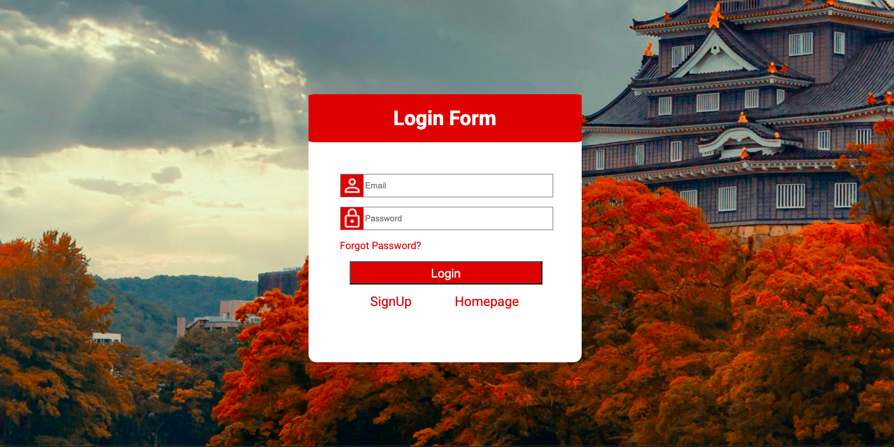
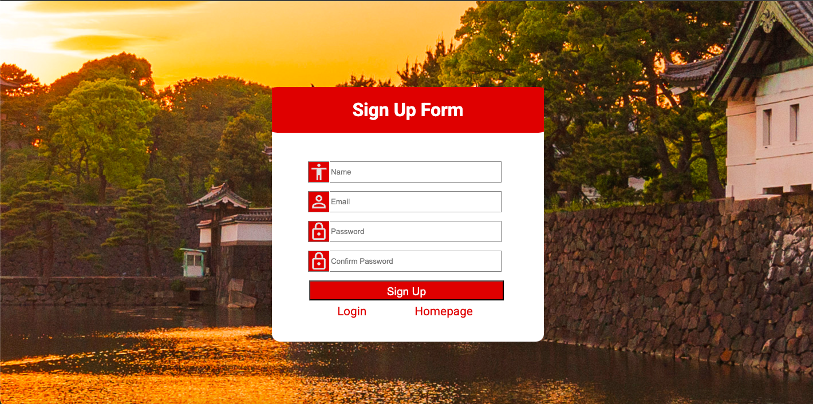
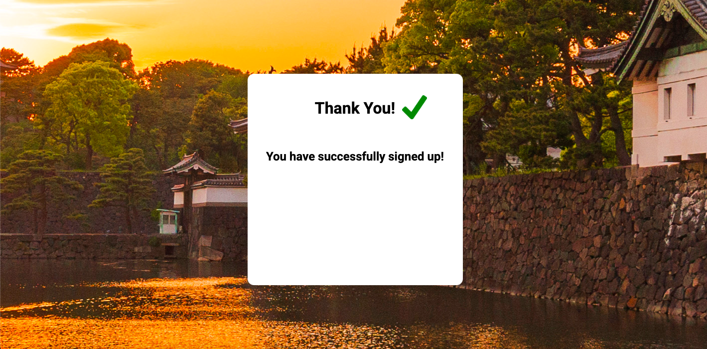

# Travel Japan Landing Page

### Landing pages are a common website that Web Developers need to know how to make. So, I wanted to make a website to test my skills and learn how to make a landing page. Since I've traveled to Japan I decided to make it a "TravelJapan" themed website. I also wanted to try and make my first multi-page website to practice connected many different pages. This was my first project that I somewhat tried to make realistic.

### For the landing page, I added a header with a logo, buttons to connect users to every part of the website and also login/sign-up buttons. Then on the main page I added the main text to get users to sign up and then finally, on the bottom I added buttons to become a member and view the community. I also added sign-up and login pages that each have a confirmation page that thanks them and confirms their sign-up/login. To do all this I used JavaScript to link the different buttons from the landing page to connect to all the pages. Then for each page I used JS to make sure all of the parameters of the form were complete, such as password being 6 more than 6 characters, then once confirmed submitting the form to a confirmation page. If the parameters were not met, then the form would not be submitted and instead an errors tab would appear notifying the user of all the errors. I also added a clearErrors function on the pages that will clear all previous errors when a new form is submitted. Pictures of all pages will be linked below.

