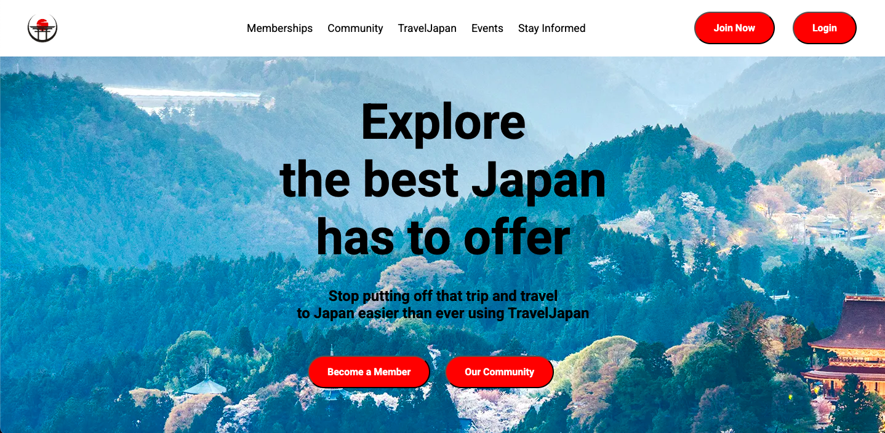

# Travel Japan Landing Page

### Landing pages are a common website that Web Developers need to know how to make. So, I wanted to make a website to test my skills and learn how to make a landing page. Since I've traveled to Japan I decided to make it a "TravelJapan" themed website.

### I added a header with a logo, buttons to connect users to every part of the website and also login/sign-up buttons. Then on the main page I added the main text to get users to sign up and then finally, on the bottom I added buttons to become a member and view the community.

